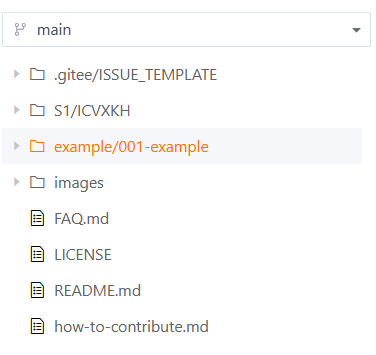
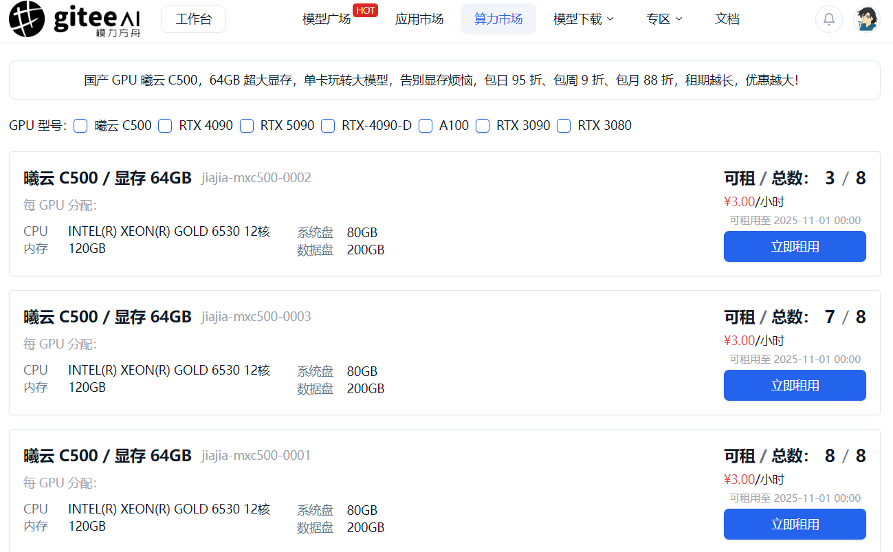
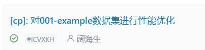
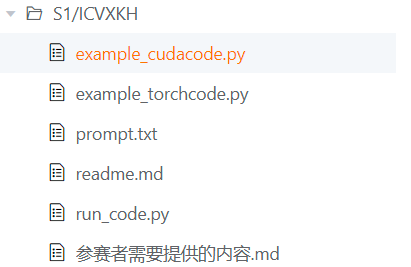
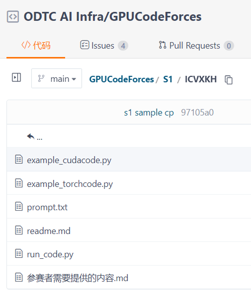

# 评测数据集生成挑战赛（GPUCodeForces）

欢迎参加 **评测数据集生成挑战赛** 📊！   本比赛旨在构建一个标准化、可用于 GPU 性能测试的评测数据集，帮助开发者更高效地比较不同硬件和框架的性能表现。

---

## 💻 比赛背景简介

在 AI 模型开发和部署中，**GPU 性能评测**是一个非常重要的环节。   不同 GPU、不同深度学习框架（如 PyTorch、TensorFlow、PaddlePaddle 等）在运行相同任务时，速度、吞吐量、内存占用等表现差异很大。   本次挑战赛希望通过社区的力量，**构建一个标准化、带权重的评测数据集**，让 GPU 性能比较更加科学、公正。

---

## 🎯 比赛目标

*   从 **PyTorch、PaddlePaddle、TensorFlow、Jax、MMCV、Transformers** 等框架中收集并生成评测样本。
    
*   为每个样本提供**标准输出**和**性能指标**，确保结果可复现。
    
*   最终形成 **GPU CodeForces** 数据集和评价方法。
    

---

## 📥 参赛流程

* 进入[GPUCodeForces赛事首页](https://gitee.com/ccf-ai-infra/GPUCodeForces)，登录参与本期比赛的Gitee账号，完成一份成功合并到仓库内的提交即为参赛成功！时间自由，方法自由，只要有灵感就可以动手开code~

   ### 🌰举个栗子

   * 登录or注册自己的Gitee账号后，进入赛事首页查看仓库内的文件内容。仔细阅读[how-to-contribute.md](https://gitee.com/ccf-ai-infra/GPUCodeForces/blob/main/how-to-contribute.md)，完成CLA签署，并熟悉提交流程。

   * 看到仓库内文件，有一个example文件夹：

     
   
     这是我们提供的一个样例，接下来我们在这个基础上进行一次完整的算子优化的提交（我们鼓励大家自己找到更好的算子并优化）。

   * 我们将样例clone到自己电脑上，
     并关注四份文件：  torchcode.py、prompt.txt、cudacode_ori.py、example_cudacode.py，最终需要提交的代码文件正是这四个。本次比赛在[模力方舟](https://ai.gitee.com/compute)平台上使用沐曦算力，需要使用算力券购买实例：

     

     接着便可以在云端实例上进行代码修改。相关算力券的领取方式请见[算力平台使用说明](https://ai.gitee.com/docs/compute/container)、[算力券兑换发放和兑换](https://ai.gitee.com/docs/billing/coupons)。

   * 然后在该比赛仓库新建一个issue，填写赛题。这里我们是对example-001算子优化，因此issue的主题就可以是“对001-example数据集进行性能优化”：

     
   
     可以看到这里有一个“#ICVXKH”，这是issue id，你的算子优化、新算子都应该绑定一个独立的issue id（最终有多少份issue被审核通过，就表示提交成功了多少份）。在即将提交的时候，在该赛题仓库的S1文件夹下新建一个以该id命名（无需带#号）的文件夹，该文件夹内容为四份必要文件和其他视参赛者情况需要补充的材料（如readme文件、用到的其他数据集等）：

     

   * 准备工作就绪，接下来看到example-001内的代码：

     **example_torchcode.py：** 基准模型（Baseline）。示例提供一个简单的PyTorch模型，只包含一个ReLU激活函数。
      
      * <span style="background-color: grey; color: black; user-select: none;">get_inputs()</span>：生成模型运行时需要的输入数据。
      * <span style="background-color: grey; color: black; user-select: none;">get_init_inputs()</span>：成模型初始化所需的参数（这里就是权重矩阵 weight）。

     <span style="background-color: grey; color: black; user-select: none;">example_cudacode.py</span>：优化模型。示例使用PyTorch的load_inline功能直接编译和加载CUDA代码，创建了一个新的模型类，使用自定义CUDA实现替代PyTorch的ReLU。

     <span style="background-color: grey; color: black; user-select: none;">run_code.py</span>：验证和性能测试脚本。验证自定义CUDA实现与原始PyTorch实现的数值精度一致性，比较两种实现的性能，计算加速比。

     <span style="background-color: grey; color: black; user-select: none;">prompt.txt</span>：这里给予参赛者一些提示：

       *  要求编写自定义CUDA内核来替换PyTorch算子以获得加速

       *  可以自由选择替换哪些算子，考虑算子融合机会

       *  提供了示例语法和内联嵌入自定义CUDA算子的方法
 
       * 给出了需要优化的模型架构（简单的ReLU模型）

    * 然后我们来优化这个算子：

       <span style="background-color: skyblue; color: black; user-select: none;">example_torchcode.py</span>：从单一的ReLU操作扩展为矩阵乘法 + ReLU的复合操作，增加可学习的权重参数(weight)，指定输入张量的预期形状和输出形状。

       <span style=" background-color: skyblue; color: black; user-select: none;">example_cudacode.py</span>：采用部分替换策略，只将ReLU替换为CUDA实现，保留PyTorch的高度优化矩阵乘法。

       <span style="background-color: skyblue; color: black; user-select: none;">run_code.py</span>：增加了最大差异和平均差异计算，使用更严格的容差(1e-05)，增加了预热步骤，确保GPU状态稳定；增加迭代次数(1000次)提高测量准确性。

       <span style="background-color: skyblue; color: black; user-select: none;">prompt.txt</span>：展示了加法操作和ReLU操作两种不同的优化示例,强调了可以自由选择优化策略，包括算子融合等高级技术。

    * 优化好后，可以在模力方舟的实例上运行:

       ```sh
       python run_code.py
       ```
      确保能够正确输出结果后再准备提交。

    * 接下来将优化好的代码保存到本地，然后参照[how-to-contribute.md](https://gitee.com/ccf-ai-infra/GPUCodeForces/blob/main/how-to-contribute.md)的指引进行代码仓库的提交与合并。

    * 最终，成功提交的代码会合并到 S1/#your_issue id 下，并且你的相关pr也会关闭。就像下面这样：
    
  
  🌳一份完整的提交流程如上，期待各位自由发挥，赛出风采与水平！


### 📦 提交PR内容

*   **一个PR包含样本的目录** [提交样例](https://gitee.com/ccf-ai-infra/GPUCodeForces/tree/main/example/001-example)
    
*   每个提交目录建议包含如下：
    
    1.  **示例代码：** torch代码示例
        
    2.  **对比代码：** 和torch对应的CUDA代码
        
    3.  **测试代码入口：** run\_code.py（请务必用这个名称，提交的PR会根据这个名称在GPU上测试结果）
        
    4.  **其它文件（或目录）：** prompt（利用LLM从torch代码生成cuda代码的prompt示例）或者其它优化代码
        
    5.  **PR目录说明文件：** https://gitee.com/ccf-ai-infra/GPUCodeForces/blob/main/example/001-example/readme.md
        

### 📦 提交PR的格式

建议在开始做题目之前创建一个赛题，提交的PR和自己创建的赛题相关联。参赛选手在每个比赛周期的目录下（例如：第一期S1、第二期S2、第三期S3...）创建一个目录，目录名称赛题的ID（ICTXSZ)，例如：

```plaintext
.
├── S1(说明：第一季比赛名称)
│   ├── ICTXSZ(说明：以赛题ID命名的目录存放PR提交样本的目录)
|   |   ├── 示例代码
│   |   ├── 对比代码
|   |   └── ……
│   └── ……
└── S2(第二季比赛)
    └── 赛题1

```

### ⭐审核流程

*   在一切文件都准备好并且提交后，在对应的PR下会得到回复：
    

<image src="./images/readme_comment_check.png">

也就是说，除了能够自己在服务器上运行得到算子测算的初步结果外，还可以在这里看到最终的测算结果。这里显示测试通过才能进入后续审核流程。

### ✅ 参赛资格

*   你提交的PR样本中，**至少有 1 个样本被评审通过并正式整合到“GPU CodeForces” 数据集**，即可算作有效参赛。
    

### ⚠️注意事项

1.  请勿抄袭他人代码或成果
    
2.  请勿恶意提交（如相同算子多次提交、相近优化重复提交）  
    \---相近优化：即指同一份参赛用例在优化后加速比没有提升或更低的用例提交
    
3.  请遵守提交的格式要求、内容规范
    

---

## 🏅 竞赛排名机制

1.  **优先按接受数量从高到低排序作为排名，取前12名。**
    
2.  若接受数量相同：
    
    *   比较总基础评分高者优先
        
    *   若仍相同，比加分项得分高者优先
        

> **接受数量** = 提交并被评审通过的样本总数

> **接受数量相同需要区分排名时如下的基础和甲方的评分规则才会生效**

---

## 📈 评分规则

### 📊 基础得分

| 内容 | 分值 |
| --- | --- |
| 提供标准 GT 输出生成函数（Numpy-CPU / 原始框架实现） | +2 分 |
| CUDA 执行时间评估 | +5 分 |
| CUDA 吞吐量评估 | +4 分 |
| CUDA 内存带宽评估 | +3 分 |

### ✨ 加分项

| 内容 | 分值 |
| --- | --- |
| 提供 Prompt 让 LLM 生成对应的 CUDA 代码，并同样进行性能评价 | 额外加分 |

---

## 📚 术语解释

*   **评测数据集**：用来测试 GPU 性能的一组标准化样本，包括代码、输入数据和预期结果。
    
*   **GT（Ground Truth）**：标准参考答案或结果，用来验证程序运行是否正确。
    
*   **吞吐量（Throughput）**：每秒钟能处理的数据量，越高表示 GPU 处理能力越强。
    
*   **内存带宽（Memory Bandwidth）**：单位时间内 GPU 内存与计算核心之间的数据传输速度。
    
*   **Prompt**：引导大语言模型（LLM）生成代码或内容的提示词。
    
*   **LLM**：Large Language Model，大语言模型，如 ChatGPT、LLaMA 等。
    

---

## 📬 联系与帮助

如需更多信息或格式说明，请查看官方文档或在本仓库提交[想法](https://gitee.com/ccf-ai-infra/GPUCodeForces/issues/new?template=feature.yml)进行讨论。  祝你挑战成功，贡献出高质量的 GPU 评测数据集！🚀

## FAQ

[第一季FAQ参考](FAQ.md)