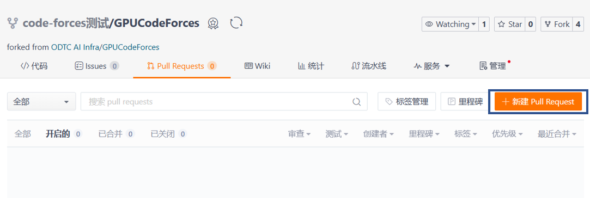

# 项目贡献指南

本项目协作采用标准的Pull Request（PR）流程机制，PR流程是开源项目协作和代码管理的核心机制。以下是创建和处理PR的详细步骤：

## 0. CLA签署
- **目的**：项目内Pull Request需要贡献者签署贡献者协议后方可合并，为保证后续项目的顺利，建议提前进行CLA签署。
- **步骤**：
  - 点击[CLA签署链接](https://gitee.com/organizations/ccf-ai-infra/cla/governance)，滑动阅读后在页面下方填写真实姓名，并选择参赛所用账号的邮箱即可。

## 1. Fork项目仓库
- **目的**：将原始仓库复制到您的Gitee（或github）账户下，以便您可以进行修改。
- **步骤**：
  - 在Gitee（或github）上找到[GPUCodeForces](https://gitee.com/ccf-ai-infra/GPUCodeForces)。
  - 点击页面右上角的“Fork”按钮，将该仓库复制到您的Gitee账户下：
  

## 2. Clone项目仓库
- **目的**：将您Fork的项目仓库克隆到本地，以便在本地进行修改。
- **步骤**：
  - 在您的本地机器上，使用`git clone`命令将项目仓库Fork的仓库克隆到本地。
  
    ```sh
    git clone https://gitee.com/giteeuseid/GPUCodeForces.git
    ```
    备注：`giteeuseid替换您的url`。


## 3. 创建赛题与分支
- **目的**：在Gitee上建立一个属于自己赛题的issue便于后期跟进。在自己克隆好的仓库的分支上进行修改，避免直接修改主分支。
- **步骤**：
  - 进入到赛事首页：[GPUCodeForces赛事首页](https://gitee.com/ccf-ai-infra/GPUCodeForces)，点击[Issues](https://gitee.com/ccf-ai-infra/GPUCodeForces/issues/new/choose)，选择赛题\[CP\]->立即开始：
  <image src="./images/readme_issue_create.png">
  然后按照模板格式填写相关信息后提交即可。在最后一个选项“推荐其他选手完成”这里，若有团队则可框选，若是自身完成则不用框选：
  <image src="./images/readme_issue_write.png">
  提交完成后，返回Issue主页可以看到自己的提交记录，可以复制Issue id进行保存：
  <image src="./images/readme_issue_id.png">

  - 在本地电脑进入克隆的仓库目录，创建一个新的分支来（例如：`dev`分支）进行您的赛题的创作或者修订。
    ```sh
    cd GPUCodeForces
    git checkout -b dev
    ```

## 4. 进行修改
- **目的**：在您的新分支上`dev`进行赛题的创作或者修订。
- **步骤**：
  - 在您的`dev`分支上进行赛题的创作或者修订。
  - 修改完成后，添加并提交您的赛题成果。
    ```sh
    git add .
    git commit -m "描述您的修改，如需要关联PR，通过fixes, closes, resolved等关键字关闭"
    #例如：git commit -m "fixes #your-issue_id"即表示关联到你自己创建的赛题id下
    ```
备注：
* Fixes #45                  → 关联Issue #45
* Resolves jquery/jquery#45  → 跨仓库关闭Issue
* Closes #45, #46            → 批量关闭多个Issue


## 5. 推送修改
- **目的**：将您的修改推送到您Fork的仓库。
- **步骤**：
  - 将您的修改推送到您Fork的仓库。
    ```sh
    git push origin dev
    #这里填写你创建的分支，不一定为dev
    ```

## 6. 创建Pull Request
- **目的**：向原始仓库的维护者提交您的修改，请求合并。
- **步骤**：
  - 回到您的Gitee账户（或github），找到您Fork的仓库。
  - 点击“New Pull Request”按钮：
  
  - 选择您推送的分支和原始仓库的主分支进行比较：
  
  - 填写PR的标题和描述，说明您的修改内容和目的：
  
  - 点击下方“创建 Pull Request”按钮，提交PR即可。

## 7. 处理反馈
- **目的**：根据项目维护者的反馈进行必要的修改。
- **步骤**：
  - 项目维护团队或者维护者会审查您的PR，并可能提出修改意见或问题，在与您相关的issue和pull request下方评论区即可查看：
  
  - 根据反馈进行必要的修改，并重复步骤4到步骤6，直到PR被接受。

## 8. PR被合并
- **目的**：一旦您的PR被接受并合并到主分支，您的贡献就正式成为项目的一部分。
- **步骤**：
  - 项目维护者会合并您的PR，您可以在这里查看各项pr的状态：
  
  - 您的修改现在成为原始仓库的一部分。

## 9. 同步上游仓库
- **目的**：保持您的Fork仓库与上游仓库同步。
- **步骤**：
  - 为了保持您的Fork仓库与上游仓库同步，您需要定期从上游仓库拉取更新：
  
  - 登录自己的Gitee账户（或github），找到您Fork的仓库。
  - 点击`Sync fork`按钮同步最新的上游Fork的仓库：
  

通过以上步骤，您就可以在Gitee（或github）上有效地参与项目的协作。希望这些信息对您有所帮助！如果有任何问题，随时欢迎提问。